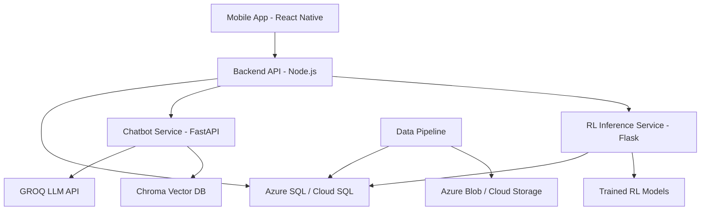

# WealthArena

WealthArena is a multi-agent investing insights platform combining reinforcement learning, real-time market analytics, and gamified education.

## Key Features

- **AI-powered trading signals** (70%+ win rate target)
- **Educational chatbot** with RAG capabilities
- **Historical fast-forward investing game**
- **Real-time leaderboard**
- **Comprehensive portfolio management**

## Technology Stack

- **Frontend**: React Native (Expo)
- **Backend**: Node.js (Express)
- **Chatbot**: Python (FastAPI)
- **RL Service**: Python (Flask)
- **Database**: Azure SQL / Cloud SQL PostgreSQL
- **Deployment**: Azure Web Apps / GCP App Engine

## Architecture



## Repository Structure

- `frontend/`: Expo mobile app (React Native)
- `backend/`: Express API server (14 route modules)
- `chatbot/`: FastAPI chatbot with RAG (11 routers)
- `rl-service/`: Flask RL inference API (6 endpoints)
- `rl-training/`: RL model training code (Ray RLlib)
- `data-pipeline/`: Market data ingestion (443 symbols, 5 asset classes)
- `database/`: SQL schemas for Azure and GCP
- `infrastructure/`: Deployment scripts for Azure and GCP
- `docs/`: Comprehensive documentation

## Quick Start

### Prerequisites
- Node.js 18+
- Python 3.8+
- Azure CLI or gcloud CLI

### Setup
1. Clone repository
2. Install dependencies: `npm install` in frontend/backend, `pip install -r requirements.txt` in services
3. Configure environment: Copy `.env.example` to `.env` and fill in values
4. Run local services: Use provided batch files or start individually
5. Test frontend: `cd frontend && npm start`

## Deployment

- **Frontend**: See `frontend/README.md` for deployment instructions
- **Backend**: See `backend/TROUBLESHOOTING.md` for deployment troubleshooting
- **RL Training**: See `rl-training/DEPLOYMENT.md` for local and Azure deployment
- **Azure**: Follow `docs/deployment/PHASE11_AZURE_DEPLOYMENT_GUIDE.md`
- **GCP**: Follow `docs/deployment/PHASE12_GCP_DEPLOYMENT_GUIDE.md`

## Development

- Local database setup (Azure SQL or PostgreSQL)
- Data pipeline execution for market data
- Model training (optional, use pre-trained models)

## Testing

### Overview
WealthArena uses Jest for TypeScript/JavaScript services and pytest for Python services.

### Running Tests

**Backend**:
```bash
cd backend
npm test              # Run tests with coverage
npm run test:watch    # Watch mode
npm run test:ci       # CI mode with JUnit output
```

**Frontend**:
```bash
cd frontend
npm test              # Run tests with coverage
npm run test:watch    # Watch mode
npm run test:ci       # CI mode
```

**Python Services**:
```bash
# Chatbot
cd chatbot
pytest --cov=app --cov-report=xml --cov-report=term

# RL Training
cd rl-training
pytest --cov=src --cov-report=xml --cov-report=term
# See rl-training/TESTING_AND_COVERAGE.md for detailed testing guide

# RL Service
cd rl-service
pytest --cov=api --cov-report=xml --cov-report=term
```

### Coverage Reports
- Backend: `backend/coverage/lcov.info`
- Frontend: `frontend/coverage/lcov.info`
- Python: `coverage.xml` in each service directory

### Testing Guides
- Backend: See `backend/TESTING_GUIDE.md`
- Frontend: See `frontend/TESTING.md`
- Python Services: See service-specific testing guides

### SonarQube Scanning

Run SonarQube analysis with the provided script:

```bash
# Windows
scripts\run_sonarqube_scan.bat <group_id> <repo_name>

# Example
scripts\run_sonarqube_scan.bat F25 WealthArena
```

This will:
1. Run all tests (backend, frontend, Python services)
2. Generate coverage reports
3. Execute SonarQube scan with project key: `AIP-F25-<group_id>_<repo_name>`

**Note**: Set `SONAR_TOKEN` environment variable for authentication, or the script will prompt for it.

## Metrics

### Overview
WealthArena collects metrics using Prometheus for backend/RL services and comprehensive_metrics for aggregation.

### Metrics Endpoints
- **Backend**: `http://localhost:3000/api/metrics` (Prometheus format)
- **RL Service**: `http://localhost:5002/api/metrics/summary` (Prometheus format)

### Collecting Metrics for Progress Reports

**Quick Method**:
```bash
python scripts/collect_metrics.py
```
This generates `PROGRESS_REPORT_METRICS.md` with formatted tables.


### Metrics Guide
See [docs/METRICS_COLLECTION.md](docs/METRICS_COLLECTION.md) for detailed instructions on:
- Collecting metrics from all services
- Interpreting metrics values
- Troubleshooting metrics collection
- SonarQube integration

### Progress Report Template
Use [PROGRESS_REPORT_TEMPLATE.md](PROGRESS_REPORT_TEMPLATE.md) as a base for weekly progress reports.

## API Documentation

- [Backend API](docs/api/API_REFERENCE.md)
- [Chatbot API](docs/api/CHATBOT_API.md)
- [RL Service API](docs/api/RL_SERVICE_API.md)

## License

MIT
