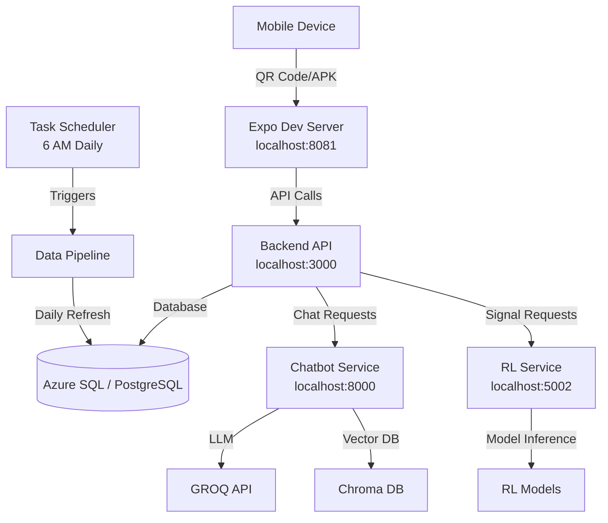

# WealthArena Local Setup Guide

## Overview

This guide provides comprehensive instructions for setting up the WealthArena development environment on your local machine. The setup process installs dependencies, configures environment variables, sets up database connectivity, starts all services, and prepares the system for mobile device testing.

**Estimated Setup Time:** 30-60 minutes (excluding data download)

**What Gets Installed:**
- Node.js dependencies for frontend and backend
- Python packages for chatbot, RL service, and data pipeline
- Environment configuration files
- Windows Task Scheduler job for daily data refresh
- EAS build configuration for Android APK

## Prerequisites

Before running the setup script, ensure you have the following installed:

### Required

1. **Node.js 18+**
   - Download: https://nodejs.org/
   - Verify: `node --version`

2. **Python 3.8+**
   - Download: https://www.python.org/
   - Verify: `python --version`

3. **npm** (comes with Node.js)
   - Verify: `npm --version`

4. **Database**
   - Azure SQL Database (cloud) OR
   - PostgreSQL (local or cloud)
   - Connection credentials

5. **10GB free disk space** (for data files)

6. **Active internet connection**

### Optional

- **Git** - For version control
  - Download: https://git-scm.com/
  - Verify: `git --version`

- **Expo Go app** on mobile device
  - iOS: https://apps.apple.com/app/expo-go/id982107779
  - Android: https://play.google.com/store/apps/details?id=host.exp.exponent

## Quick Start

### Automated Setup (Recommended)

Run the master setup script:

```powershell
# Basic setup
.\master_setup_local.ps1

# With options
.\master_setup_local.ps1 -SkipDataDownload -DatabaseType azuresql

# Skip APK build
.\master_setup_local.ps1 -SkipAPKBuild
```

The script will guide you through each phase interactively.

## Script Parameters

| Parameter | Description | Default |
|-----------|-------------|---------|
| `-SkipDependencies` | Skip npm/pip installations | `false` |
| `-SkipDataDownload` | Skip market data download | `false` |
| `-SkipDataProcessing` | Skip data processing step | `false` |
| `-SkipAPKBuild` | Skip Android APK build | `false` |
| `-DatabaseType` | `azuresql`, `postgresql`, or `skip` | `azuresql` |
| `-LocalIPOverride` | Manually specify local IP address | Auto-detect |

## What the Script Does

### Phase 1: Prerequisites Check
- Verifies Node.js (v18+), Python (3.8+), npm
- Checks for Git (optional) and EAS CLI
- Auto-detects local IP address for mobile testing
- Installs EAS CLI if missing

### Phase 2: Dependency Installation
- **Frontend**: `npm install` in `frontend/`
- **Backend**: `npm install && npm run build` in `backend/`
- **Chatbot**: `pip install -r requirements.txt` in `chatbot/`
- **RL Service**: `pip install -r requirements.txt` in `rl-service/`
- **Data Pipeline**: `pip install -r requirements.txt` in `data-pipeline/`

### Phase 3: Environment Configuration
Creates `.env.local` files for all services:
- `backend/.env.local` - Database config, service URLs, CORS origins
- `chatbot/.env.local` - Port, GROQ API key
- `rl-service/.env.local` - Port, model mode, database config
- `frontend/.env.local` - Service URLs with local IP
- `data-pipeline/sqlDB.env` - Database credentials

### Phase 4: Database Setup
- Tests database connection (Azure SQL or PostgreSQL)
- Offers to run schema creation scripts:
  - `database/azure_sql_schema.sql` for Azure SQL
  - `database/postgresql_schema.sql` for PostgreSQL

### Phase 5: Service Startup
Starts all services in separate PowerShell windows:
- **Backend** (port 3000): `npm run dev`
- **Chatbot** (port 8000): `python main.py`
- **RL Service** (port 5002): `python inference_server.py`
- **Frontend** (port 8081): `npm start` (Expo)

Each service is health-checked after startup.

### Phase 6: Data Pipeline Execution
- Runs `data-pipeline/run_all_downloaders.py` in MVP mode (100 stocks)
- Runs `data-pipeline/processAndStore.py` to compute indicators
- Stores processed data in database

### Phase 7: Scheduler Setup
- Creates `scripts/daily_data_refresh.ps1` for automated data refresh
- Registers Windows Task Scheduler job:
  - Name: `WealthArena_DailyDataRefresh`
  - Schedule: Daily at 6:00 AM
  - Executes: `infrastructure/data_pipeline_standalone/run_full_pipeline.bat`

### Phase 8: APK Build Configuration
- Creates `frontend/eas.json` with build profiles (development, preview, production)
- Checks EAS CLI login status
- Offers to build Android APK (15-30 minutes)

### Phase 9: Verification & Summary
- Tests all service health endpoints
- Displays service URLs and local IP
- Provides QR code instructions for Expo
- Shows next steps

## Manual Setup (Alternative)

If the automated script fails, you can set up manually:

### 1. Install Dependencies

```powershell
# Frontend
cd frontend
npm install

# Backend
cd ..\backend
npm install
npm run build

# Chatbot
cd ..\chatbot
pip install -r requirements.txt

# RL Service
cd ..\rl-service
pip install -r requirements.txt

# Data Pipeline
cd ..\data-pipeline
pip install -r requirements.txt
```

### 2. Create Environment Files

Copy and customize the `.env.local` files created by the script, or create them manually based on `.env.example` files in each service directory.

### 3. Setup Database

- **Azure SQL**: Add your IP to firewall rules, run `database/azure_sql_schema.sql`
- **PostgreSQL**: Ensure PostgreSQL is running, run `database/postgresql_schema.sql`

### 4. Start Services

Open separate terminal windows for each service:

```powershell
# Terminal 1: Backend
cd backend
npm run dev

# Terminal 2: Chatbot
cd chatbot
python main.py

# Terminal 3: RL Service
cd rl-service\api
python inference_server.py

# Terminal 4: Frontend
cd frontend
npm start
```

## Configuration Files

### Backend (.env.local)

```env
NODE_ENV=development
PORT=3000
DB_TYPE=azuresql
DB_SERVER=your-server.database.windows.net
DB_NAME=your-database
DB_USER=your-username
DB_PASSWORD=your-password
CHATBOT_URL=http://localhost:8000
RL_SERVICE_URL=http://localhost:5002
CORS_ORIGINS=http://localhost:3000,http://localhost:8081,http://YOUR_IP:3000,http://YOUR_IP:8081
```

### Chatbot (.env.local)

```env
APP_PORT=8000
ENVIRONMENT=local
GROQ_API_KEY=your-groq-api-key-here
```

### RL Service (.env.local)

```env
PORT=5002
MODEL_MODE=mock
```

### Frontend (.env.local)

```env
EXPO_PUBLIC_DEPLOYMENT_ENV=local
EXPO_PUBLIC_BACKEND_URL=http://YOUR_IP:3000
EXPO_PUBLIC_CHATBOT_URL=http://YOUR_IP:8000
EXPO_PUBLIC_RL_SERVICE_URL=http://YOUR_IP:5002
```

Replace `YOUR_IP` with your local IP address (detected automatically by the script).

## Testing the Setup

### Verify Services

Use the status check script:

```powershell
.\scripts\check_services_status.ps1
```

Or test manually:

```powershell
# Backend
Invoke-WebRequest http://localhost:3000/health

# Chatbot
Invoke-WebRequest http://localhost:8000/health

# RL Service
Invoke-WebRequest http://localhost:5002/health
```

### Test from Mobile Device

1. **Ensure device is on the same network** as your development machine
2. **Find your local IP**: The script displays it, or run:
   ```powershell
   Get-NetIPAddress -AddressFamily IPv4 | Where-Object {$_.IPAddress -notlike "127.*"}
   ```
3. **Scan QR code** from Expo dev server window
4. **Or install APK** when build completes

### Check Database Connectivity

```powershell
# Test Azure SQL (requires pyodbc)
cd data-pipeline
python -c "import pyodbc; print('ODBC driver available')"
```

## Mobile Device Connection

### Connecting to Expo Dev Server

1. Start the frontend service: `cd frontend && npm start`
2. A QR code will appear in the terminal
3. Open Expo Go app on your mobile device
4. Scan the QR code
5. The app will load and connect to local services

### Installing APK

1. Build APK: `cd frontend && eas build --platform android --profile development`
2. Download the APK when build completes
3. Transfer to Android device
4. Enable "Install from unknown sources" on device
5. Install the APK

### Troubleshooting Connection Issues

- **Can't connect from mobile**: Ensure device and computer are on the same Wi-Fi network
- **Firewall blocking**: Allow ports 3000, 8000, 5002, 8081 in Windows Firewall
- **IP address changed**: Update `frontend/.env.local` with new IP and restart frontend
- **CORS errors**: Add your device IP to `CORS_ORIGINS` in `backend/.env.local`

## Data Pipeline

### Understanding the Data Refresh Schedule

The Windows Task Scheduler runs the data pipeline daily at 6:00 AM:
- Downloads latest market data
- Computes technical indicators
- Generates RL trading signals
- Stores results in database

### Manually Triggering Data Refresh

```powershell
# Run full pipeline
cd infrastructure\data_pipeline_standalone
.\run_full_pipeline.bat

# Or use the PowerShell script
.\scripts\daily_data_refresh.ps1
```

### Modifying the Scheduler

```powershell
# Change schedule time
schtasks /change /tn WealthArena_DailyDataRefresh /st 08:00

# View task details
schtasks /query /tn WealthArena_DailyDataRefresh /v /fo LIST

# Delete task
schtasks /delete /tn WealthArena_DailyDataRefresh /f
```

### Data Storage Locations

- **Raw data**: `data-pipeline/data/raw/`
- **Processed data**: `data-pipeline/data/processed/`
- **Database**: Stored in configured database (Azure SQL or PostgreSQL)
- **Logs**: `local_setup_logs/daily_refresh_YYYYMMDD.log`

## Troubleshooting

### Common Issues

#### Port Conflicts

**Error**: "Port 3000 is already in use"

**Solution**:
```powershell
# Find process using port
netstat -ano | findstr :3000

# Kill process (replace PID)
taskkill /PID <PID> /F

# Or change port in backend/.env.local
PORT=3001
```

#### Database Connection Errors

**Error**: "Cannot connect to database"

**Solutions**:
- Verify credentials in `.env.local` or `sqlDB.env`
- For Azure SQL: Add your IP to firewall rules
- For PostgreSQL: Ensure service is running
- Test connection manually with SQL client

#### Python/Node Version Issues

**Error**: "Module not found" or "Syntax error"

**Solution**:
- Verify Python version: `python --version` (requires 3.8+)
- Verify Node version: `node --version` (requires 18+)
- Reinstall dependencies: `pip install -r requirements.txt` or `npm install`

#### Firewall/Network Issues

**Error**: "Connection refused" from mobile device

**Solution**:
1. Check Windows Firewall settings
2. Allow ports 3000, 8000, 5002, 8081
3. Ensure device and computer are on same network
4. Verify local IP address hasn't changed

#### Service Startup Failures

**Error**: Service doesn't start or crashes immediately

**Solution**:
1. Check service logs in PowerShell windows
2. Verify `.env.local` files exist and are configured
3. Check for missing dependencies
4. Review error messages in `local_setup_logs/`

## Stopping Services

### Using the Stop Script

```powershell
# Interactive (with confirmation)
.\scripts\stop_all_services.ps1

# Force stop (no confirmation)
.\scripts\stop_all_services.ps1 -Force
```

### Manual Stop

```powershell
# Find and stop processes
Get-Process | Where-Object {$_.ProcessName -match 'node|python|expo'} | Stop-Process

# Or close PowerShell windows manually
```

## Updating Configuration

### Change Service Ports

1. Update port in service's `.env.local` file
2. Update service URL in other services' `.env.local` files
3. Restart affected services

### Switch Between Azure SQL and PostgreSQL

1. Update `DB_TYPE` in `backend/.env.local`
2. Update connection details in `.env.local` files
3. Update `data-pipeline/sqlDB.env`
4. Restart services

### Update API Keys

1. Edit `.env.local` files directly
2. For GROQ API key: Update `chatbot/.env.local`
3. Restart chatbot service

### Modify Data Pipeline Settings

1. Edit scripts in `data-pipeline/` or `infrastructure/data_pipeline_standalone/`
2. Update `sqlDB.env` for database changes
3. Test manually before scheduler runs

## Next Steps

After successful setup:

1. **Access Backend API Documentation**
   - Open: http://localhost:3000
   - Explore available endpoints

2. **Test the Chatbot**
   - Send requests to: http://localhost:8000
   - Check health: http://localhost:8000/health

3. **View Trading Signals**
   - Access RL Service: http://localhost:5002
   - Check health: http://localhost:5002/health

4. **Test Mobile App**
   - Scan QR code from Expo dev server
   - Or install APK on device
   - Verify connectivity to local services

5. **Deploy to Azure** (when ready)
   - See: `master_automation.ps1`
   - Follow: `docs/deployment/PHASE11_AZURE_DEPLOYMENT_GUIDE.md`

## Architecture Diagram



## FAQ

### Why do I need a local IP address?

Mobile devices need to connect to your local services over the network. The local IP address allows your device to reach services running on your development machine.

### Can I use a different database?

Yes! The script supports Azure SQL and PostgreSQL. Set `-DatabaseType postgresql` or update `.env.local` files manually.

### How do I update the data?

The scheduler runs daily at 6 AM. To update manually:
```powershell
cd infrastructure\data_pipeline_standalone
.\run_full_pipeline.bat
```

### How do I rebuild the APK?

```powershell
cd frontend
eas build --platform android --profile development
```

### Can I run this on Mac/Linux?

The master setup script is PowerShell-specific for Windows. For Mac/Linux:
1. Install dependencies manually (see Manual Setup section)
2. Use `npm start` and `python` commands directly
3. Create `.env.local` files manually
4. Use cron instead of Task Scheduler for data refresh

### Where are the logs?

- Setup logs: `local_setup_logs/master_setup_YYYYMMDD_HHMMSS.log`
- Daily refresh logs: `local_setup_logs/daily_refresh_YYYYMMDD.log`
- Service logs: Check PowerShell windows where services are running

### How do I reset everything?

1. Stop all services: `.\scripts\stop_all_services.ps1 -Force`
2. Delete `.env.local` files
3. Delete `node_modules` and reinstall: `npm install` / `pip install -r requirements.txt`
4. Run setup script again: `.\master_setup_local.ps1`

## Additional Resources

- **Project README**: See `README.md` for project overview
- **Frontend README**: See `frontend/README.md` for frontend-specific setup
- **Backend README**: See `backend/README.md` for backend details
- **Azure Deployment**: See `master_automation.ps1` for cloud deployment

## Support

For issues or questions:
1. Check the Troubleshooting section above
2. Review logs in `local_setup_logs/`
3. Check service-specific documentation
4. Review error messages in PowerShell windows

---

**Last Updated**: 2024
**Script Version**: 1.0.0

